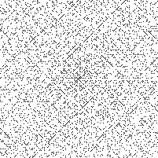
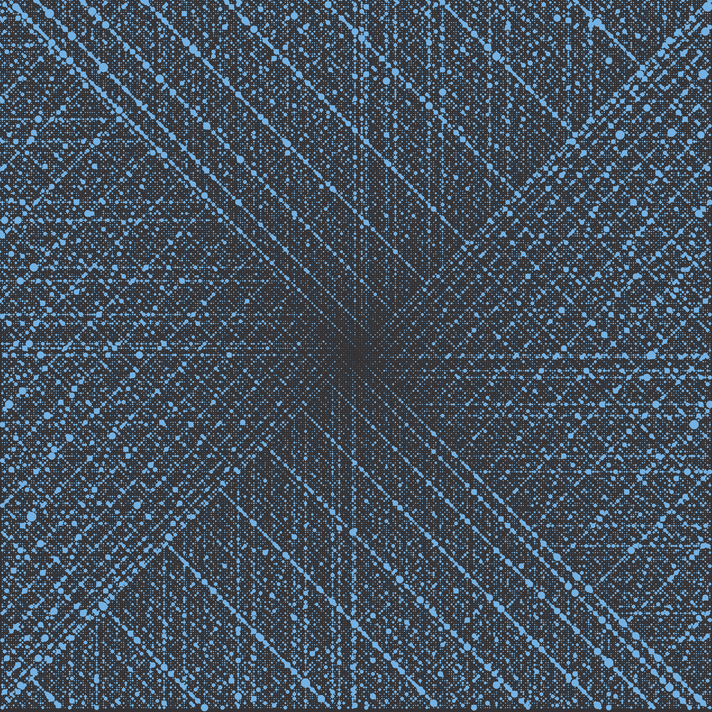
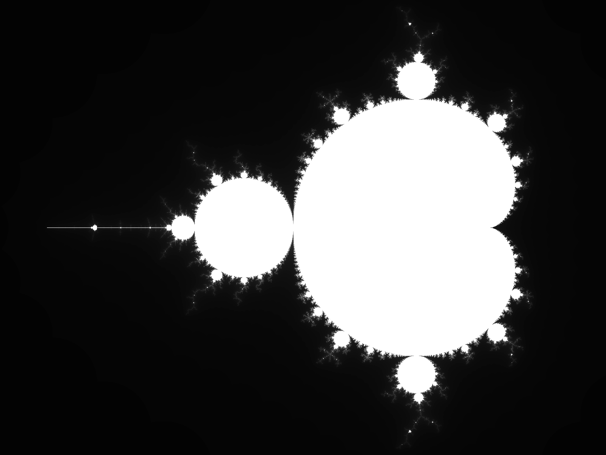
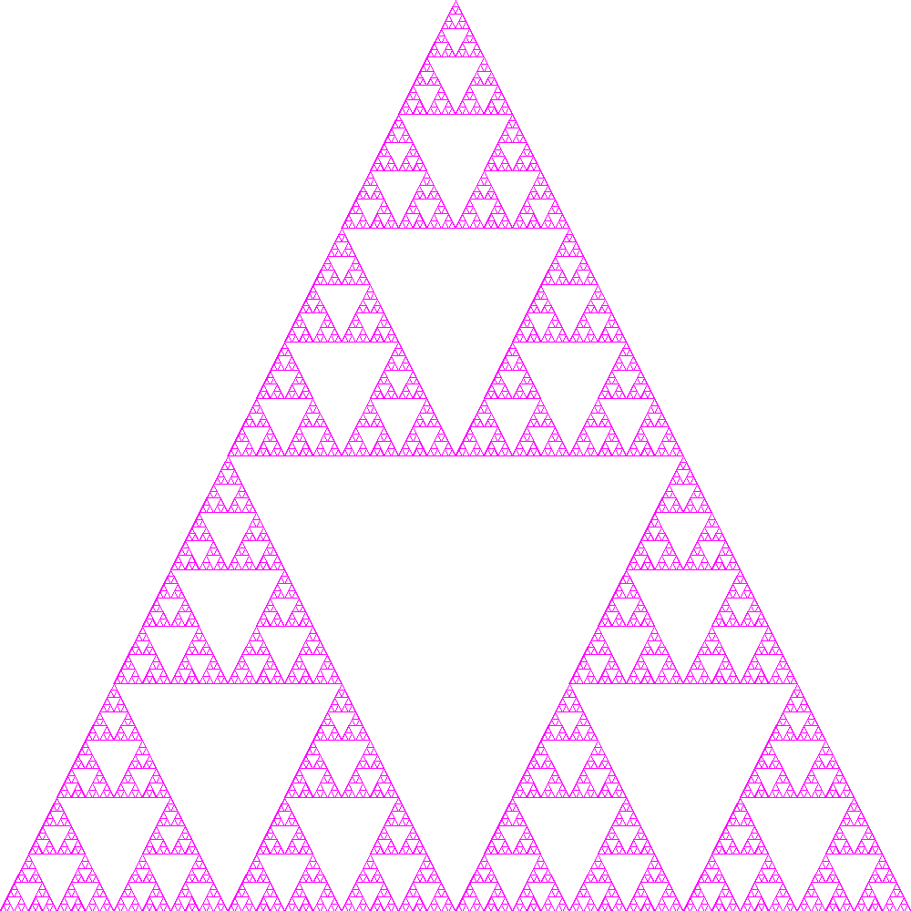

# How images in the showcase were generated

All commands were run from the repo base

## ulam-spiral.webp

Generated with the following:  
`cargo run -- --output showcase/ulam-spiral.webp ulam-spiral`

A stock standard ulam spiral, not much special here.

## ulam-spiral-divisor.webp

Generated with the following:  
`cargo run -- --output showcase/ulam-spiral-divisor.webp ulam-spiral --mode divisor --size 100000 --color #74b2e4 --background-color #343234`

This one was constructed to match [this image](https://en.wikiquote.org/wiki/File:Ulam_Spiral_Divisors_100000.png)

## mandelbrot.webp

Generated with the following:  
`cargo run --release -- --output showcase/mandelbrot.webp mandelbrot --gradient`

## tangent-wave.png

Generated with the following:  
`cargo run --release -- --output showcase/tangent-wave.png wave --color orangered --wave-type tangent`

## sierpinski-zoom.png

Generated with the following:  
`cargo run --release -- --output showcase/sierpinski-zoom sierpinski --color fuchsia --zoom`
